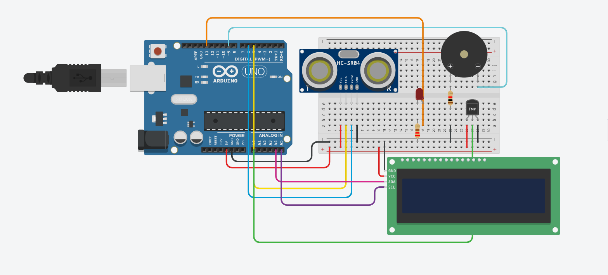

# 💧 Smart Water Bottle System

A health-focused embedded IoT system built with Arduino that tracks hydration in real-time through sensor-driven monitoring and automated alerts.

## 🛠️ Tech Stack
- **Hardware:** Arduino
- **Sensors:** Temperature sensor, Water level sensor
- **Output:** LCD display, Buzzer alerts
- **Architecture:** OSI & TCP/IP model mapping

## ⚙️ How It Works
1. Temperature and water level sensors continuously monitor the bottle
2. Readings are processed by the Arduino microcontroller
3. LCD display shows real-time hydration status
4. Buzzer triggers alerts when hydration levels are low or temperature is abnormal

## 📐 Circuit Diagram

## 🌐 System Architecture
Built with IoT protocols mapped to OSI and TCP/IP models, ensuring a scalable and maintainable sensor-to-output pipeline.

## 📄 Project Context
Major Project — Asia Pacific University (APU), May – Jul 2025
